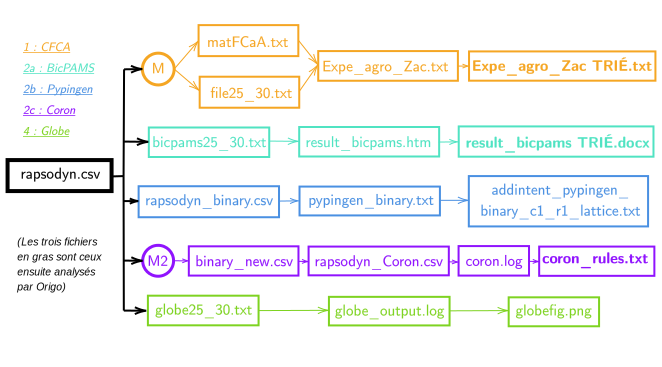

# Projet MIRRORS Assoumani - Avril à Juin 2022

Ce projet rassemble les programmes et batteries de tests élaborés durant ma participation au [projet *MIRRORS*](https://drive.google.com/drive/u/1/folders/1pRKWO7v_S38VOYmB1Lu1T3bpWAjBV2Si).


## Prérequis

Logiciels nécessaires au fonctionnement du projet :

```
Python
Modules Python : [pip install] python-docx matplotlib numpy networkx
```

Version de Python utilisée :

```
Python 3.7.3
```

## Présentation du dépôt
Ce répertoire de travail se divise en trois parties :
- `codes_sources` contient les algorithmes utilisés pour inférer ou vérifier les liens de causalité :
  - `FormalCausalityAnalysis` (*=CFCA*), dont le fichier principal `FCaA.py` extrait les règles
  - `CSC` (*=Pypingen*), dont le programme principal `addIntent.py` est pour l'instant trop long à l'exécution
  - `coron-0.8` (*=Coron*), dont les scripts `AssRuleX` et `filterRules` infèrent et trient des règles d'association
  - `globe_v20220213` (*=Globe*), dont le programme principal `main.py` renvoie la matrice d'adjacence d'un diagramme causal
  - `origo_master3` (*=Origo*), dont les méthodes dans `score.py` infèrent un sens pour une règle multivariée
- `RAPSODYN_Zachary_20220414\DATA` compte les données brutes, ainsi que les 2 versions des données prétraitées
- `files` contient tous les fichiers intermédiaires créés et manipulés par le programme
- `main.py` est le programme principal, traitant les données en leur appliquant ces algorithmes.


## Structure de `main.py`

Notre étude utilise cinq approches différentes, dans des cadres différents.

Pour généralement chacune d'elles, notre programme contient une phase de pré-traitement (*=mettre en forme les données pour les rendre utilisables en argument de l'algorithme*), d'exécution, et de post-traitement (*=trier les sorties de l'algorithme et/ou les afficher de manière lisible*).

Ici, les sorties des parties 1 (*CFCA*), 2a (*BicPAMS*) et 2c (*Coron*) sont vérifiées par la partie 5 (*Origo*), tandis que la partie 4 (*Globe*) est exécutée indépendamment.


## Utilisation de fichiers intermédiaires
A noter que les fonctions de `main.py` interagissent entre elles en récupérant des fichiers et en en produisant d'autres, afin de garder une trace en mémoire de chaque phase. Ils sont tous présents dans le dossier `files`. J'y ai volontairement laissé les fichiers créés lors de mes propres exécutions, afin que les dernières phases du programme puissent être lancées indépendamment sans nécessiter les précédentes.



**Exemple de l'approche 1 :**

→ à l'aide du tableur *rapsodyn_temp_25_30.csv*, `preprocess()` produit une matrice et un en-tête

→ grâce auxquels `CFCA_process()` produit *matMFCaA.txt* et *file25_30.txt*

→ grâce auxquels l'exécution de `FCaA.py` produit *Expe_agro_Zac_v1.txt*

→ que `CFCA_postprocess()` trie pour obtenir *Expe_agro_Zac_v1 TRIÉ.txt*.